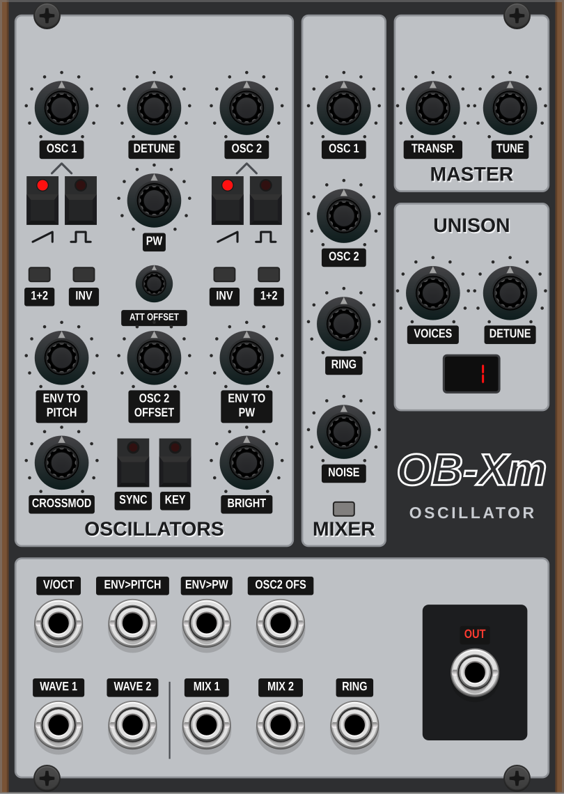
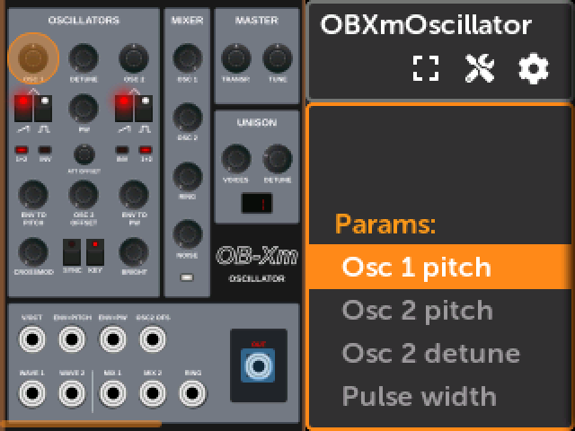
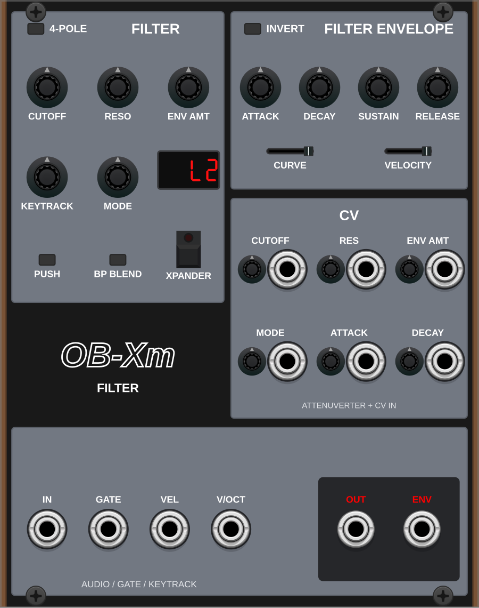
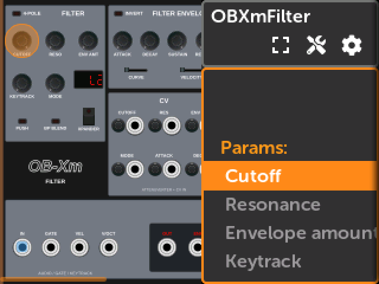
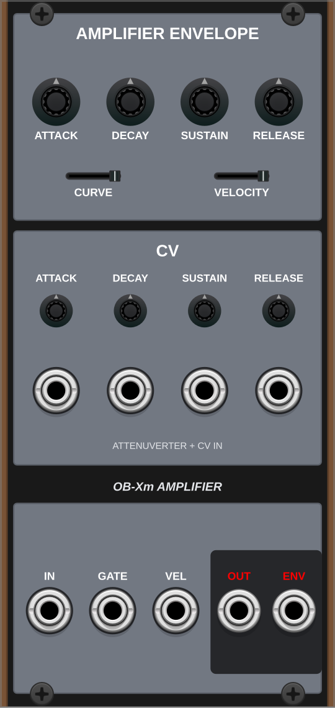
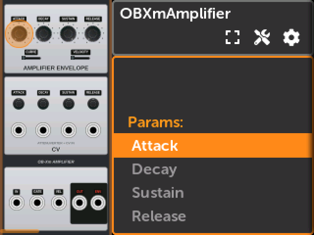
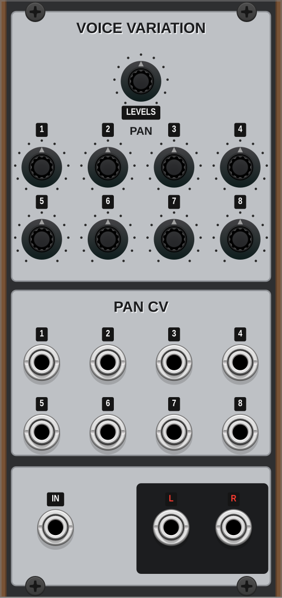
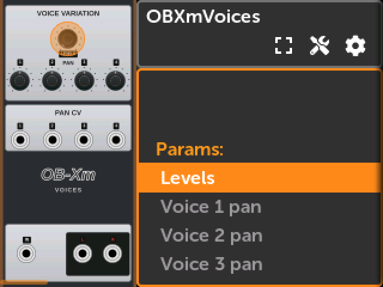
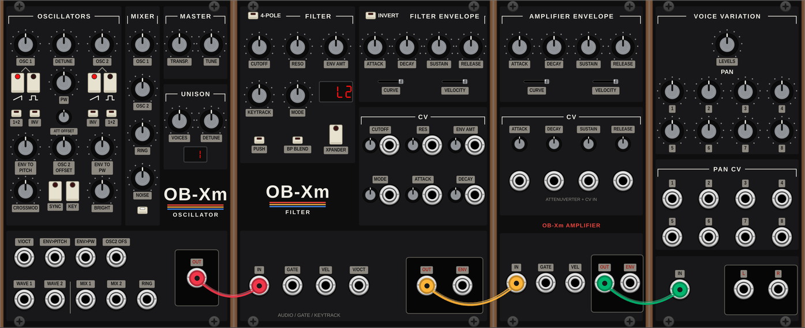
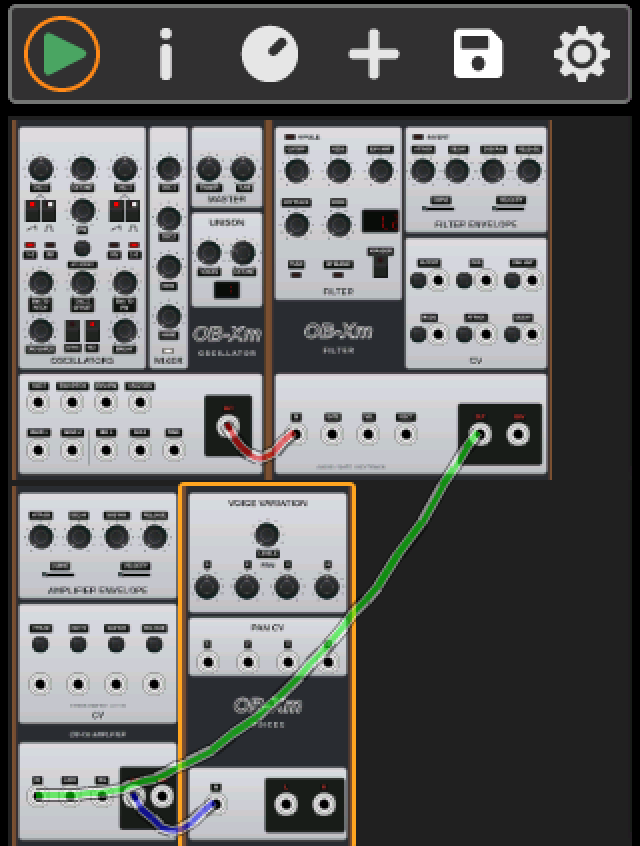

# OB-Xm

Polyphonic modules for **VCV Rack 2** and the **4ms MetaModule**, built from
the DSP code of [**OB-Xf**](https://github.com/surge-synthesizer/OB-Xf), the Surge
Synth Team's continuation of OB-Xd (originally by Vadim Filatov / discoDSP):

- **OBXm Oscillator** — OB-Xf's two oscillators, mixer, unison and detune.
- **OBXm Filter** — OB-Xf's multimode filter with its filter envelope.
- **OBXm Amplifier** — OB-Xf's amplifier envelope and VCA.
- **OBXm Voice Variation** — OB-Xf's per-voice pan and level variation: polyphonic in, stereo out.


This project is not affiliated with the Surge Synth Team.

## Screenshots

| | VCV Rack | MetaModule |
|---|---|---|
| **OBXm Oscillator** (18 HP) |  |  |
| **OBXm Filter** (20 HP) |  |  |
| **OBXm Amplifier** (12 HP) |  |  |
| **OBXm Voice Variation** (12 HP) |  |  |

**Panel styles** (VCV Rack): every module has two faceplates, chosen in its context
menu under *Panel style*: **OB-Xf Light** (default, above), inspired by OB-Xf's light
skin, and **OB-8 Noir**, inspired by the Oberheim OB-X / OB-Xa / OB-8 hardware. The
choice is saved with the patch; the last style chosen becomes the default for new
modules, and *Apply to all OB-Xm modules* switches the whole patch. The MetaModule
uses OB-Xf Light.

OB-8 Noir, the full chain: Oscillator → Filter → Amplifier → Voice Variation.



The full chain on the MetaModule (patch view): Oscillator → Filter → Amplifier →
Voice Variation.



## Installation

Download the files from the [latest release](https://github.com/Donmanouche/OB-Xm/releases/latest).

- **VCV Rack 2** (Linux x64 build): copy `OB-Xm-<version>-lin-x64.vcvplugin` into your Rack
  user plugins folder (`~/.local/share/Rack2/plugins-lin-x64/` on Linux) and restart
  Rack. Other platforms: build from source (see below).
- **4ms MetaModule**: copy `OB-Xm.mmplugin` into a `metamodule-plugins/` folder at the
  root of an SD card or USB drive, and load it from the MetaModule's plugin menu.
  Polyphonic cables need a recent firmware.

Release numbers (0.1, ...) differ from the version VCV Rack and the MetaModule
display: Rack 2 requires plugin versions in 2.x, so release 0.1 is plugin version 2.0.1.

## OBXm Oscillator (18 HP)

| Section | Controls (as in OB-Xf) |
|---|---|
| Oscillators | OSC 1 and OSC 2 pitch (±24 semitones), DETUNE (osc 2, 0–60 cents), saw / pulse buttons per oscillator (both off = triangle), PW, OSC 2 OFFSET (osc 2 PW offset), ENV TO PITCH (0–36 st) and ENV TO PW with their **1+2** (both oscillators / osc 2 only) and **INV** buttons, CROSSMOD, SYNC, KEY (osc 2 keytrack), BRIGHT |
| Mixer | OSC 1, OSC 2, RING MOD, NOISE, noise colour button (white / pink / red) |
| Master | TRANSPOSE (±24 semitones, stepped), TUNE (±100 cents) |
| Unison | VOICES (1 = off, up to 8; 4 on MetaModule), DETUNE |
| Context menu | Snap OSC 1 / OSC 2 pitch to semitones (on by default; OB-Xf does it with a modifier drag), HQ (2× oversampling, OB-Xf's HQ mode) — VCV Rack only |

Inputs (all polyphonic):

- **V/OCT** (0 V = C4). Its channel count sets the module's polyphony.
- **ENV>PITCH**, **ENV>PW**: an external envelope, 0–10 V standing for OB-Xf's
  filter envelope (0–1). The ENV TO PITCH / ENV TO PW knobs set the amount.
- **OSC2 OFS**: added to OSC 2 OFFSET, 10 V = full range, through the small "CV"
  "ATT OFFSET" attenuverter next to the OSC 2 OFFSET knob.
- **WAVE 1**, **WAVE 2** (not in OB-Xf): waveform of each oscillator, overriding its
  buttons while patched: 0–2.5 V triangle, 2.5–5 V saw, 5–7.5 V pulse, 7.5–10 V
  saw + pulse (0.1 V hysteresis at the boundaries). The buttons' LEDs show the
  waveform actually played (channel 0).
- **MIX 1**, **MIX 2**, **RING** (not in OB-Xf): added to the mixer's OSC 1, OSC 2
  and RING MOD knobs, 10 V = full range.

Output: **OUT**, polyphonic, at a fixed level: one saw at full mix is about ±5 V
(OB-Xf's internal level ×10/3), the level OBXm Filter expects. As in OB-Xf, unison
voices and the two oscillators add up (both at full level: ±10 V, unison: ±25–40 V).
OBXm Filter applies a fixed output gain after the filter.

**Amp envelope.** OB-Xf's voice ends with an amplifier envelope: patch
**OBXm Amplifier** after OBXm Filter (or any VCA driven by an ADSR), otherwise the
oscillators keep sounding between notes. Suggested chain: Oscillator → Filter →
Amplifier → Voice Variation.

## OBXm Filter (20 HP)

| Section | Controls (as in OB-Xf) |
|---|---|
| Filter | CUTOFF, RESONANCE, ENV AMT, KEYTRACK, MODE, 4-POLE, XPANDER, PUSH and BP BLEND (OB-Xf's 2-pole options), mode display |
| Output level | fixed, after the filter: one saw through an open filter = ±2.5 V, leaving headroom for resonance, both oscillators and unison (Rack's Audio module sums polyphonic channels and hard-clips at ±10 V) |
| Filter envelope | ATTACK, DECAY, SUSTAIN, RELEASE (1 ms – 60 s), CURVE (exponential → linear attack), VELOCITY, INVERT |
| CV | attenuverter + input for CUTOFF, RES, ENV AMT, MODE, ATTACK, DECAY |
| Context menu | HQ (2× oversampling) — VCV Rack only |

Filter modes, as in OB-Xf:

- **2-pole**: MODE morphs low-pass → high-pass (→ band-pass in the middle with BP BLEND).
- **4-pole**: MODE morphs LP4 → LP3 → LP2 → LP1.
- **4-pole + XPANDER**: MODE selects one of the 15 Xpander modes
  (LP4 LP3 LP2 LP1 HP3 HP2 HP1 BP4 BP2 N2 PH3 HP2+LP1 HP3+LP1 N2+LP1 PH3+LP1),
  shown on the display with OB-Xf's names.

Inputs and CV conventions:

| Input | Scale |
|---|---|
| IN | audio, polyphonic; its channel count sets the module's polyphony |
| GATE | triggers the envelope (Schmitt trigger 0.1 V / 1 V) |
| VEL | 0–10 V = velocity 0–1, read on the gate's rising edge; 1 when unpatched. Used through the VELOCITY slider, like OB-Xf |
| V/OCT | keytrack pitch, 0 V = C4; KEYTRACK sets the amount exactly as in OB-Xf |
| CUTOFF | 1 V/oct (12 semitones per volt) at full attenuverter |
| RES, ENV AMT | added to the knob, 10 V = full range |
| ATTACK, DECAY | added to the envelope knobs, 10 V = full range (not in OB-Xf's panel; a new time applies to the running stage, as OB-Xf's modulation matrix does) |
| MODE | added to the knob, 10 V = full range. With XPANDER on, 0–10 V (knob at 0, attenuverter at 100 %) is spread over the 15 modes: mode = round(V / 10 × 14), one mode every 0.71 V (0 V = LP4, 10 V = PH3+LP1) |

Outputs: **OUT** (polyphonic audio) and **ENV** (the velocity-scaled envelope,
0–10 V; negative when INVERT is on).

## OBXm Amplifier (12 HP)

OB-Xf's amplifier envelope and its linear VCA, one envelope per voice. Its
character comes from OB-Xf's envelope: a rounded attack (exponential with
overshoot, blendable to linear), a sustain capped at 90 %, the 32-sample envelope
delay of OB-Xf's voice and a little per-voice timing variation (25 %, as OB-Xf's
default ENVELOPES slop).

| Section | Controls |
|---|---|
| Amplifier envelope | ATTACK, DECAY (4 ms – 60 s), SUSTAIN, RELEASE (8 ms – 60 s), CURVE (exponential → linear attack), VELOCITY (as in OB-Xf) |
| CV | attenuverter + input for ATTACK, DECAY, SUSTAIN, RELEASE: added to the knob, 10 V = full range (not in OB-Xf's panel; a new time applies to the running stage, as OB-Xf's modulation matrix does) |

| Input / output | |
|---|---|
| IN | audio, polyphonic |
| GATE | one envelope per channel (Schmitt trigger 0.1 V / 1 V); the polyphony is the larger of the IN and GATE channel counts, so a mono IN can be shaped per voice |
| VEL | 0–10 V = velocity 0–1, read on the gate's rising edge; 1 when unpatched |
| OUT | IN × envelope, polyphonic |
| ENV | the applied envelope, 0–10 V (9 V at full sustain) |

## OBXm Voice Variation (12 HP)

OB-Xf's **Voice Variation** section for a polyphonic patch: it takes the
polyphonic audio (from OBXm Amplifier, or from the VCA after OBXm Filter) and mixes the voices
to a stereo pair, as OB-Xf's voice engine does.

| Control | |
|---|---|
| PAN 1–8 (1–4 on MetaModule) | pan of each voice, OB-Xf's linear law (left = 1 − pan, right = pan); voice *n* uses pan *n* mod 8, so voices 9–16 reuse pans 1–8 in VCV Rack |
| PAN CV 1–8 (1–4) | added to the matching pan knob, 10 V = full range (+5 V moves a centred voice fully right) |
| LEVELS | per-voice level variation (OB-Xf's level slop: gain 1 − 0.67 × LEVELS × a fixed random value per voice). OBXm Oscillator already applies OB-Xf's default 25 %, so this adds to it and defaults to 0 |

Inputs / outputs: **IN** (polyphonic audio), **L** and **R**. Use it instead of a
mono Sum to bring the voices together.

OB-Xf's other Voice Variation controls are not in this module: FILTERS and
ENVELOPES act inside OBXm Filter (fixed at OB-Xf's default, 25 %), and there is no
glide in these modules (GLIDE).

## Differences from OB-Xf

- **Unison and the filter**: OB-Xf runs one filter per unison voice; here the
  unison voices of a channel are summed and filtered once (–70 dB difference in
  A/B renders at moderate resonance, more as the filter saturates).
- **HQ**: OB-Xf oversamples the whole voice; here the oscillator and the filter
  each oversample and decimate, and the filter upsamples its input by linear
  interpolation. HQ adds about 9 samples of latency (–38 dB difference).
- **Envelope source**: ENV TO PITCH / PW take an external envelope instead of
  OB-Xf's internal filter envelope (patch the filter's ENV output to get the
  OB-Xf routing, one sample later).
- **Panel**: colours, knobs, buttons, sliders and displays follow OB-Xf's
  default VectorTheme; the OB-Xf logo itself is not reproduced (plain text).

## Building

### VCV Rack

```bash
RACK_DIR=~/rack-sdk make
RACK_DIR=~/rack-sdk make dist      # dist/OB-Xm-<version>-lin-x64.vcvplugin
RACK_DIR=~/rack-sdk make install   # into the local Rack user folder
```

C++20 is needed (OB-Xf's `Noise.h` uses `std::countr_zero`).

### MetaModule

Requires `arm-none-eabi-gcc` 12.2/12.3 (or 13–15.x), cmake ≥ 3.22, ninja and
Python 3, and the [MetaModule plugin SDK](https://github.com/4ms/metamodule-plugin-sdk):
clone it next to this repository (`../metamodule-plugin-sdk`) or point
`-DMETAMODULE_SDK_DIR=...` / the `METAMODULE_SDK_DIR` environment variable at it.

```bash
cd metamodule
cmake --fresh -B build -G Ninja -DTOOLCHAIN_BASE_DIR=/path/to/arm-toolchain/bin
cmake --build build
```

The plugin is written to `metamodule/metamodule-plugins/OB-Xm.mmplugin`; copy
that directory to the root of an SD card or USB drive.

### MetaModule simulator

The plugin also builds into the 4ms simulator as an external "built-in" brand
(see the simulator's `docs/simulator-ext-plugins.md`). Add to
`simulator/ext-plugins.cmake`:

```cmake
list(APPEND ext_builtin_brand_paths "/path/to/OB-Xm/metamodule")
list(APPEND ext_builtin_brand_libname "ObXm")
list(APPEND ext_builtin_brand_slug "OB-Xm")
```

then `cmake --build build` in `simulator/`. For that build only,
`metamodule/CMakeLists.txt` adds `-fno-weak` (the simulator's `ld -r` + `objcopy`
prelink otherwise breaks inline functions shared with the host, such as
`std::to_string`). Patches use the slugs `OB-Xm:OBXmOscillator` and
`OB-Xm:OBXmFilter`.

## Layout

- `src/` — the two modules, UI components, generated `PanelLayout.hpp`
- `src/dsp/` — oscillator and filter engines (no Rack dependency)
- `thirdparty/obxf/` — OB-Xf DSP headers (`engine/`, unmodified) and the JUCE shim (`shim/`)
- `res/` — faceplates and components
- `metamodule/` — MetaModule build: CMake, `plugin-mm.json`, PNG assets

## License

GPL-3.0-or-later (see `LICENSE`), as required by the OB-Xf code it contains.
OB-Xf: © 2013–2025 the OB-Xd / OB-Xf authors, see
<https://github.com/surge-synthesizer/OB-Xf>.
